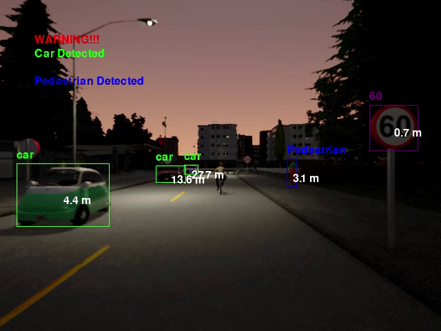
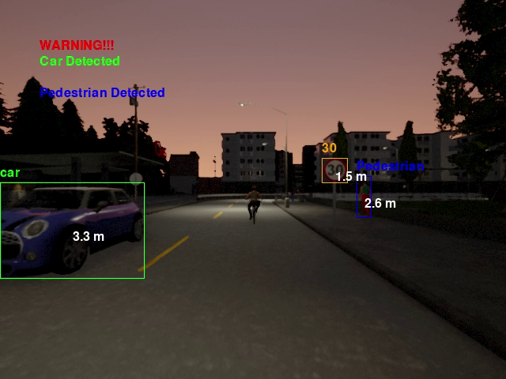
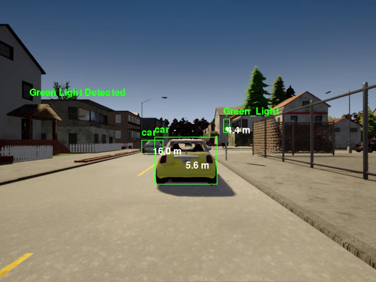
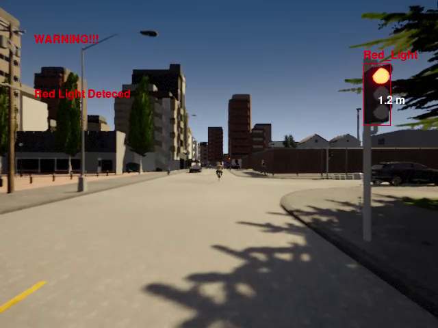

# CARLA Simulation with YOLOv8 for Autonomous Driving



## Project Overview
This project integrates the CARLA simulator with four YOLOv8 nano models to enable object detection, motion planning, and decision-making for autonomous driving. The models used in this simulation are trained to detect various objects in the environment and calculates it distances for motion planning and decision making, ensuring real-time perception and response to traffic scenarios.

### Key Features:
- **YOLOv8 Integration**: Uses four trained YOLOv8 nano models for real-time object detection.
  - `cartruck_models` - Detects vehicles (cars and trucks).
  - `roadsign_model` - Identifies road signs.
  - `trafficlight_model` - Recognizes traffic lights.
  - `pedestrian_models` - Detects pedestrians.
- **Simulation Data Collection**: Logs and analyzes model performance and motion planning.
- **Waypoint Navigation**: Uses `location_targets.txt` to define start points and target locations for each CARLA town.
- **Multi-Camera Setup**:
  - `singlecam.py` - Uses a single camera for object detection.
  - `threecam.py` - Employs three front-facing cameras.
  - `eightcam.py` - Uses eight cameras positioned around the vehicle for full 360-degree perception.
- **Dynamic Weather Control**: `dynamic_weather.py` modifies the simulation’s weather conditions.
- **Manual Control**: `manual_control.py` allows for user-driven testing.
- **Pruning and Performance Optimization**:
  - `pruning.py` optimizes the model’s size and efficiency.
  - `Resize.py` adjusts image sizes for better annotation and training.
- **Data Collection Scripts**:
  - `RGB_SEG_collection.py` and `RGB_img.py` handle dataset collection for model training.
- **Spawn NPCs for Traffic Simulation**: `spawn_npc.py` generates dynamic actors in the environment.
- **Dependency Management**: Install required dependencies via `pip install -r requirements.txt`.

## Folder Structure
```
📂 Project Root
 ├── 📁 cartruck_models
 ├── 📁 roadsign_model
 ├── 📁 trafficlight_model
 ├── 📁 pedestrian_models
 ├── 📁 simulation_data
 ├── location_targets.txt
 ├── RGB_SEG_collection.py
 ├── RGB_img.py
 ├── Resize.py
 ├── singlecam.py
 ├── threecam.py
 ├── eightcam.py
 ├── dynamic_weather.py
 ├── manual_control.py
 ├── pruning.py
 ├── requirements.txt
 ├── spawn_npc.py
```

## Installation
1. Clone the repository:
   ```sh
   git clone https://github.com/Micahmichael03/Carla_car_simulation_Yolov8_detection.git
   cd your-repo
   ```
2. Install dependencies:
   ```sh
   pip install -r requirements.txt
   ```
3. Run the simulation with different camera configurations:
   ```sh
   python singlecam.py
   python threecam.py
   python eightcam.py
   ```

## Usage
- To train or fine-tune YOLOv8 models, collect data using `RGB_SEG_collection.py` and `RGB_img.py`.
- For image size adjustments, use `Resize.py`.
- To test manual control, run `manual_control.py`.
- For dynamic traffic scenarios, use `spawn_npc.py`.
- Modify `location_targets.txt` to set waypoints for autonomous navigation.

## Performance Analysis
- **Simulation Data**: Collected in the `simulation_data` folder to analyze detection accuracy and motion planning effectiveness.
- **Model Optimization**: `pruning.py` enhances model efficiency for real-time inference.

## Results




##



##



## Future Work
- Integration of additional sensors like LiDAR.
- Improvement of motion planning algorithms.
- Further model pruning and optimization for better real-time performance.

## Acknowledgments
- [CARLA Simulator](http://carla.org/)
- [Ultralytics YOLOv8](https://github.com/ultralytics/ultralytics)

---

**Author:** Michael Chukwuemeka Micah  
For inquiries, contact: makoflash05@gmail.com

